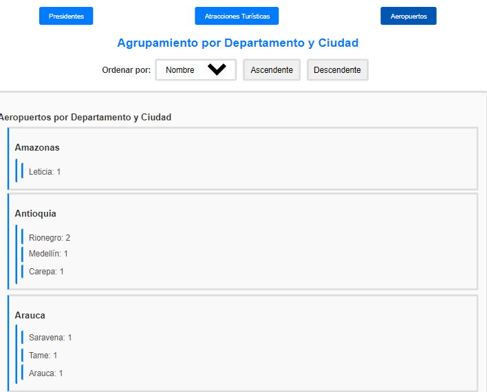
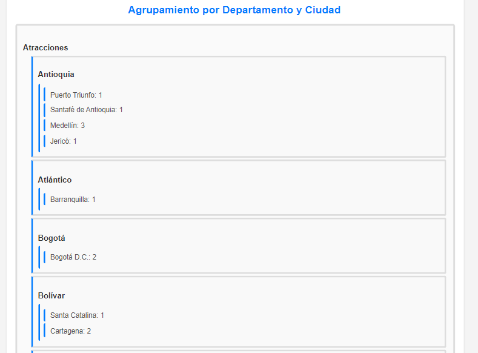

# Colombian API - Omar Vargas


## Descripción del Proyecto 📝

Este proyecto es una aplicación web desarrollada en React que consume una API pública de Colombia. La aplicación presenta datos agrupados sobre Presidentes, Aeropuertos y Atracciones Turísticas en Colombia. Además, la aplicación ha sido dockerizada para facilitar su despliegue.

## Vista Previa de la Aplicación 🖥️

Aquí tienes algunas capturas de pantalla de la aplicación en funcionamiento:

### 1. Pantalla Aeropuerto



### 2. Tab de Presidentes


### 3. Otra Funcionalidad


## Estructura del Proyecto 🗂️

- **/src**: Código fuente de la aplicación React.
- **/public**: Archivos estáticos y el archivo `index.html` principal.
- **Dockerfile**: Archivo de configuración para la creación de la imagen Docker.
- **docker-compose.yml**: (Opcional) Archivo de configuración para Docker Compose.
- **package.json**: Dependencias y scripts de npm.
- **README.md**: Documentación del proyecto.

## Requisitos Previos 🔧

- **Node.js** (versión 14 o superior)
- **npm** (gestor de paquetes de Node.js)
- **Docker** (para la ejecución en contenedores)
- **Git** (para la clonación y manejo del repositorio)

## Instalación y Ejecución Local 🚀

1. **Clonar el Repositorio**

   Clona este repositorio a tu máquina local usando Git:

   ```bash
   git clone https://github.com/tu_usuario/colombian_api_omarvargas.git
   cd colombian_api_omarvargas
